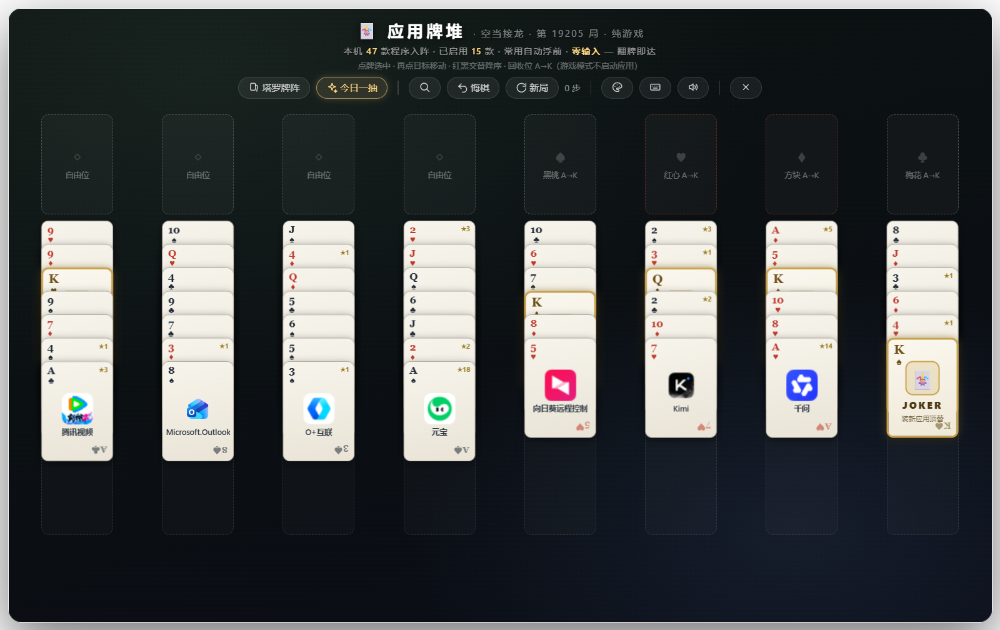

# 应用牌堆 Launcher Deck

> 把本机所有程序洗成一副塔罗牌 —— 零输入，翻牌即达。

## 产品介绍

**应用牌堆**是一个托盘常驻的桌面应用启动器。它把你电脑里安装的所有程序自动扫描成一副塔罗牌阵：每个程序是一张牌，常用程序自动浮到最前排，悬停即可翻牌查看详情，点击即启动——**不需要记住程序名字，不需要打一个字**。

灵感来自塔罗牌：应用程序不该藏在层层菜单里，它们应该像一副牌一样摊开在桌面上，一眼扫过、伸手即得。

### 它解决什么问题

| 传统启动方式的痛点 | 应用牌堆的答案 |
|---|---|
| 开始菜单/桌面图标越积越多，找个程序要翻半天 | 全部程序一页摊开，一屏全览 |
| 搜索启动器需要记得并输入程序名字 | 零输入：浏览即达，认图标就行 |
| 分不清哪个是常用程序 | 常用自动浮前 + 置顶区，高频程序永远在视线第一排 |
| 想按自己的习惯分类，系统不给机会 | 花色归类体系：自动归类 + 右键自定义 + 拖拽归类 + 自建分类 |

## 功能特性

- 🃏 **塔罗牌阵启动模式** —— 本机程序全部成牌，悬停翻面看详情，点击启动
- 📌 **常用置顶区** —— 手动置顶 + 使用频率×时间衰减自动排序，高频程序固定大卡置顶
- ♦ **花色归类体系** —— 社交通讯/影音/浏览器/开发/效率/系统六大花色 + 自建分类，右键归类、拖拽归类
- 🀄 **空当接龙游戏模式** —— 微软原版发牌算法（1-32000 局，局局可通关），标准规则，进度自动保存
- ⌨️ **全键盘操作** —— 方向键选牌、回车启动
- 🔍 **拼音首字母搜索** —— 输 `db` 出豆包（兜底，平时用不到才叫兜底）
- 🎨 **今日一抽** —— 每日一签，看看今天适合开哪个应用
- ⌨ **全局热键 Ctrl+J** —— 随时唤起/收起，托盘常驻
- 🌈 **主题系统** —— 蒂芙尼毛玻璃等多套配色

## 下载安装

**[⬇ 从 GitHub Releases 下载最新安装包](https://github.com/dgr1771/launcher-deck/releases/latest)**

Windows 10/11 双击安装（NSIS 一键安装），装完托盘出现 ✦ 图标，按 `Ctrl+J` 唤起牌阵。

## 使用速览

| 操作 | 效果 |
|---|---|
| `Ctrl+J` | 唤起 / 收起牌阵 |
| 悬停牌面 | 3D 翻面看详情 + 牌意解读 |
| 单击牌面 | 启动程序 |
| 右键牌面 | 置顶 / 归类 / 立即启动 |
| 方向键 + 回车 | 键盘选牌启动 |
| 🎮 按钮 | 切换空当接龙游戏模式（纯游戏，不会误启动程序） |

## 技术栈

Electron 37 · 原生 JavaScript · 无框架 · 38 项自动化回归测试

## 开发人员

**隔壁村布布**

---

*应用牌堆 Launcher Deck · v0.2.2*
